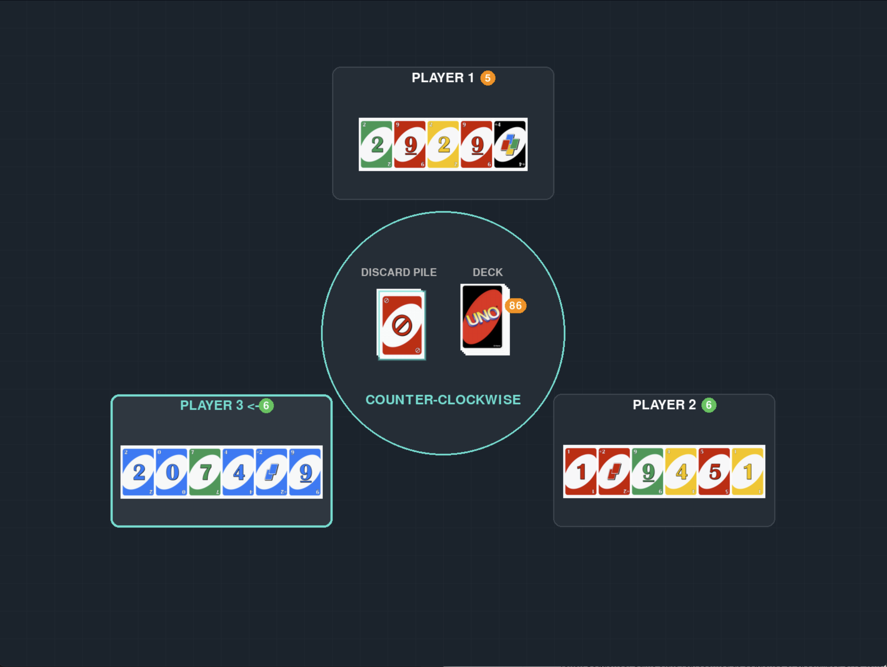

# UNO AI - Reinforcement Learning Training Environment

A UNO card game implementation with AI agents trained using Proximal Policy Optimization (PPO). This project provides a complete training environment for developing intelligent UNO players with support for multi-agent scenarios, self-play training, and real-time visualization.



## 🎮 Features

### Core Components
- **Custom Gymnasium Environment**: Full UNO game implementation following OpenAI Gym standards with support for Normal and Street rules
- **Pygame Visualization**: Real-time rendering of game states with high-quality card graphics and DPI scaling
- **Multi-Agent Training**: Support for various training scenarios including self-play and mixed opponents
- **Transformer-based Architecture**: Custom PPO agent with specialized token vocabulary (100 tokens)
- **PPO Implementation**: Proximal Policy Optimization with custom reward shaping and configurable hyperparameters

### Game Rules Support
- **Normal Rules**: Standard UNO gameplay with traditional draw and play mechanics
- **Street Rules**: Alternative ruleset with draw-until-playable and +2/+4 card stacking
- **Dynamic Rule Selection**: Random game mode assignment during training for robust learning
- **Player Position Randomization**: Agents train from all player positions (0-3) for generalization

### Training Capabilities
- **Self-Play Training**: Agents learn by playing against copies of themselves
- **Mixed Opponent Training**: Train against combinations of AI agents, random players, and rule-based opponents
- **Random Position Training**: Agents experience all player positions during training
- **Scenario-Based Learning**: Multiple training scenarios with different player counts (2-4 players)
- **Configurable PPO**: Customizable learning rate, gamma, GAE lambda, and other hyperparameters

### Visualization & Monitoring
- **Real-time Pygame Rendering**: Watch AI agents play with smooth animations and card graphics
- **DPI-Aware Display**: Automatic scaling for high-resolution displays
- **Training Statistics**: Comprehensive logging of win rates, episode lengths, and scenario performance
- **Asset Management**: High-quality card images with dynamic scaling support

## 🚀 Quick Start

### Installation

```bash
# Clone the repository
git clone https://github.com/daniel3303/UnoAI.git
cd UnoAI

# Install the package and requirements
pip install -e .
```

### Basic Usage

#### Train a PPO Agent
```bash
# Basic PPO training with random positions and game modes
uno-train-ppo --timesteps 1000000 --learning-rate 3e-4

# Multi-agent training with self-play
uno-train-multi-agent --timesteps 2000000 --gamma 0.99
```

#### Evaluate Trained Models

The evaluation system allows you to test trained AI agents against different types of opponents:

```bash
# Evaluate a single trained agent against environment opponents
uno-evaluate --model-paths models/uno_ppo_final_model.pt none none none --episodes 100

# Watch a trained agent play with visual rendering (slower pace for observation)
uno-evaluate --model-paths models/uno_multi_agent_final.pt none none none --episodes 5 --render --delay 2

# Test multiple trained agents against each other
uno-evaluate --model-paths models/agent1.pt models/agent2.pt none none --episodes 50

# 3-player game with mixed opponents
uno-evaluate --num-players 3 --model-paths models/trained_agent.pt none environment --episodes 20 --render

# Head-to-head between two trained agents
uno-evaluate --num-players 2 --model-paths models/agent1.pt models/agent2.pt --episodes 100
```

**Player Types:**
- **Trained Agent**: Specify path to `.pt` model file
- **Environment Player**: Use `none` or `environment` for rule-based AI opponents
- **Random Player**: Automatically filled when fewer model paths provided

**Key Parameters:**
- `--model-paths`: List of model paths for each player position (Player 0, 1, 2, 3)
- `--num-players`: Game size (2-4 players, default: 4)
- `--episodes`: Number of games to play for evaluation
- `--render`: Enable visual game display with Pygame
- `--delay`: Seconds between moves when rendering (useful for observation)

**Example Configurations:**
```bash
# Single agent evaluation (most common)
uno-evaluate --model-paths models/my_agent.pt none none none --episodes 100

# Agent vs agent comparison
uno-evaluate --model-paths models/agent_v1.pt models/agent_v2.pt none none --episodes 50

# Watch training progress with visualization
uno-evaluate --model-paths checkpoints/model_update_40.pt none none none --episodes 3 --render --delay 1.5
```

The evaluator reports win rates, average rewards, and episode lengths to assess agent performance.

## 🏗️ Architecture

### Environment (`uno_ai.environment`)
- **UNOEnv**: Main Gymnasium environment with observation/action spaces
- **UNOGame**: Core game logic implementing standard UNO rules
- **MultiAgentUNOEnv**: Extended environment supporting multiple AI agents

### Model (`uno_ai.model`)
- **UNOTransformer**: Custom transformer architecture for UNO gameplay
- **UNOTokens**: Specialized vocabulary system for representing game states
- **Multi-Head Attention**: Attention mechanism with RoPE embeddings

### Training (`uno_ai.training`)
- **PPOTrainer**: Single-agent PPO implementation
- **MultiAgentPPOTrainer**: Multi-agent training with scenario sampling
- **ParallelMultiAgentTrainer**: Parallel training with multiprocessing support

### Visualization
- **Pygame Renderer**: Real-time game visualization with card graphics
- **Asset Manager**: High-resolution image loading and scaling
- **DPI Scaling**: Automatic adaptation to different screen resolutions

## 🎯 Training Scenarios

The training system supports various scenarios to create robust AI players:

### 4-Player Scenarios
- **Self-Play**: All 4 agents learning together (10% weight)
- **vs Random**: 1 agent vs 3 random players (10% weight)
- **vs Environment**: 1 agent vs 3 rule-based opponents (10% weight)
- **Mixed Training**: Combinations of agent, random, and environment players (10% weight)

### 3-Player Scenarios
- **Self-Play**: All 3 agents learning together (10% weight)
- **vs Random**: 1 agent vs 2 random players (5% weight)
- **vs Environment**: 1 agent vs 2 rule-based opponents (5% weight)
- **Mixed**: Agent vs random vs environment player (5% weight)

### 2-Player Scenarios
- **Self-Play**: Head-to-head agent training (10% weight)
- **vs Random**: 1 agent vs 1 random player (10% weight)

## 🖥️ Gymnasium Environment

The UNO environment follows OpenAI Gym standards with token-based actions:

```python
import gymnasium as gym
from uno_ai.environment.uno_env import UNOEnv
from uno_ai.environment.uno_game import GameMode

# Create environment with specific game mode
env = UNOEnv(num_players=4, game_mode=GameMode.STREET, render_mode=\"human\")

# Standard gym interface
obs, info = env.reset()
action = env.action_space.sample()
obs, reward, terminated, truncated, info = env.step(action)

# Render the game
env.render()  # Opens Pygame window with real-time visualization
```

### Action Space
- **Token-Based Actions**: 100 discrete actions representing cards and game actions
- **Card Tokens (0-81)**: Direct representation of all UNO cards
- **Action Tokens (82-83)**: Draw card and pass turn actions
- **Action Masking**: Only valid actions are enabled each turn

### Observation Space
- **Token Sequence**: Game state as sequence of 100 specialized tokens (max length: 1000)
- **Structured Format**: `[PLAY_HISTORY] [SEP] [GAME_MODE] [CURRENT_PLAYER] [PLAYER_HANDS] [SEP] [CURRENT_HAND]`
- **Rich Information**: Complete play history with player identification, hand sizes, current cards
- **Semantic Tokens**: Clear distinction between structural separators (SEP) and padding (PAD)

### Token Vocabulary (100 tokens)
- **Card Tokens (0-81)**: All UNO cards (Red 0-19, Green 20-39, Blue 40-59, Yellow 60-79, Wild 80-81)
- **Action Tokens (82-83)**: Draw action, Pass action
- **Game Mode Tokens (84-85)**: Normal rules, Street rules
- **Utility Tokens (86-87)**: Card back, Opponent identifier
- **Number Tokens (88-97)**: Digits 0-9 for encoding quantities
- **Special Tokens (98-99)**: PAD (padding), SEP (separator)

## 🎨 Pygame Visualization

The Pygame renderer provides:
- **High-Quality Card Graphics**: Asset-based rendering with fallback to programmatic drawing
- **DPI Scaling**: Automatic scaling for different screen resolutions
- **Real-time Updates**: Smooth animations and state transitions
- **Player Information**: Hand sizes, current player indicators, game statistics
- **Interactive Display**: Visual feedback for valid moves and game progression

### Visualization Features
- Circular player layout with clear current player indication
- Center discard pile and deck with card counts
- Direction indicators (clockwise/counter-clockwise)
- Win condition displays and game statistics
- Responsive design that adapts to different screen sizes

## 📊 Performance

Training metrics include:
- **Win Rate**: Agent performance against various opponents
- **Episode Length**: Game duration and efficiency
- **Scenario Statistics**: Performance breakdown by training scenario
- **Learning Curves**: Reward progression and convergence tracking

## 🛠️ Development

### Project Structure
```
uno_ai/
├── environment/     # Gym environment and game logic
│   ├── uno_env.py              # Main environment with token-based actions
│   ├── uno_game.py             # Core game with Normal/Street rules
│   ├── uno_vocabulary.py       # 100-token vocabulary system
│   └── multi_agent_uno_env.py  # Multi-agent training environment
├── agents/         # Neural network agents
│   └── ppo_agent.py           # PPO agent with transformer architecture
├── training/       # Training infrastructure
│   ├── ppo_trainer.py         # Single-agent PPO with random positions
│   ├── multi_agent_ppo_trainer.py # Multi-agent scenario-based training
│   ├── ppo_config.py          # Configurable hyperparameters
│   └── reward_calculator.py   # Custom reward shaping
├── layers/         # Neural network components
│   ├── transformer_block.py   # Transformer block with attention
│   ├── multi_head_attention.py # Attention with RoPE embeddings
│   └── swi_glu.py             # SwiGLU activation function
├── utils/          # Utilities and asset management
└── assets/         # Card images and graphics
```

### Custom Components
- **100-Token Vocabulary**: Complete representation of UNO game state and actions
- **Dual Game Modes**: Normal and Street rules with different strategic considerations
- **Position Randomization**: Agents train from all player positions for generalization
- **Structured Observations**: Clear token sequence format with semantic separators
- **Configurable Training**: Adjustable PPO hyperparameters (gamma, GAE lambda, learning rate)

## 📋 Requirements

- Python 3.12+
- PyTorch (with MPS/CUDA support)
- Pygame
- Gymnasium
- NumPy
- Additional dependencies in `requirements.txt`

## 🤝 Contributing

1. Fork the repository
2. Create a feature branch
3. Make your changes
4. Add tests if applicable
5. Submit a pull request

## 📄 License

This project is licensed under the MIT License
`